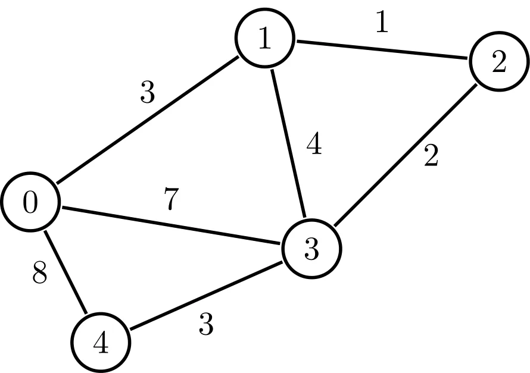

# Shortest Path in Weighted Undirected Graphs

## Weighted Graphs

The graphs that have some weights or costs on traversing through edges are called weighted graphs.

### Representation of a Weighted Graph

- By Diagrams:
<figure markdown>

<figcaption>Weighted Graph Example</figcaption>
</figure> 

- By Adjancency matrix: Weighted graphs are represented by $n\text{ x }n$ matrix where each element is represented as $(d,w)$, where $d$ is destination vertex and $w$ is the weight between the source and destination.Also, the element in $n^{th} \text{row and }j^{th}\text{ column}$ represents an edge from $j\to i$ with the weight $w.$
